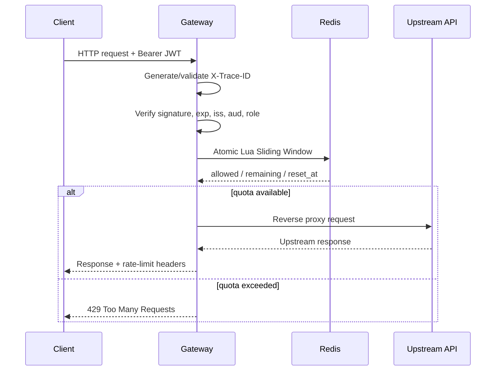

# HighLoad API Gateway

> Собственный API Gateway на Go с JWT/RBAC, распределённым rate limiting через Redis, reverse proxy и observability.


## Зачем этот проект

Это не «ещё один CRUD» и не попытка заменить Kong или NGINX в production. Проект — инженерный кейс для портфолио, который показывает, как я проектирую пограничный сервис перед backend-системами:

- как проверить, что клиент имеет право на запрос;
- как ограничить злоупотребление API между несколькими инстансами gateway;
- как безопасно проксировать трафик к разным upstream-сервисам;
- как увидеть latency, ошибки и trace конкретного запроса;
- как система ведёт себя, когда Redis или upstream недоступен.

На собеседовании этот репозиторий даёт предметный разговор про concurrency, Redis Lua, JWT, HTTP transport, graceful shutdown, failure modes, метрики и CI.

> Rate limiting защищает application layer от чрезмерного трафика. Это не замена CDN, WAF или сетевой DDoS-защите.

## Что происходит с запросом



## Возможности

### Безопасность

- строгая проверка JWT HS256;
- проверка подписи, `exp`, `iss`, `aud`;
- обязательные claims `user_id` и `role`;
- authentication никогда не работает в fail-open режиме;
- ограничение размера request body;
- таймауты на чтение заголовков, body, upstream response и idle connections;
- graceful shutdown с завершением in-flight запросов.

### Distributed rate limiting

Лимитер работает в Redis через один атомарный Lua script:

```text
ZREMRANGEBYSCORE → ZCARD → ZADD → PEXPIRE
```

Лимит считается по ключу:

```text
user_id:role:top_level_route
```

Пример политик:

```json
{
  "admin": 1000,
  "user": 10
}
```

Параметры лимита возвращаются клиенту:

```text
X-RateLimit-Limit
X-RateLimit-Remaining
X-RateLimit-Reset
Retry-After
```

### Reverse proxy

Gateway поддерживает несколько upstream-сервисов и выбирает наиболее специфичный prefix:

```json
[
  {"prefix": "/users", "upstream": "http://users:9001"},
  {"prefix": "/billing", "upstream": "http://billing:9002"},
  {"prefix": "/billing/admin", "upstream": "http://admin:9003"}
]
```

Запрос `/billing/admin/users` уйдёт в `admin`, потому что `/billing/admin` длиннее `/billing`.

### Observability

- JSON-логи через `log/slog`;
- `X-Trace-ID` создаётся gateway или принимается после валидации;
- Prometheus metrics:
  - `gateway_requests_total`;
  - `gateway_request_duration_seconds`;
  - `gateway_rate_limit_rejected_total`;
  - `gateway_upstream_errors_total`;
  - `gateway_redis_duration_seconds`;
- `/healthz` для liveness;
- `/readyz` для Redis readiness;
- `/metrics` для Prometheus.

## Архитектура

```text
                         ┌──────────────────────┐
                         │       Client         │
                         └──────────┬───────────┘
                                    │
                         ┌──────────▼───────────┐
                         │   Trace / Recovery   │
                         │   JSON request log   │
                         └──────────┬───────────┘
                                    │
                         ┌──────────▼───────────┐
                         │      JWT / RBAC      │
                         └──────────┬───────────┘
                                    │
                ┌───────────────────▼───────────────────┐
                │       Redis Lua Sliding Window        │
                │  fail-closed by default / fail-open   │
                │          as an explicit option        │
                └───────────────────┬───────────────────┘
                                    │
                         ┌──────────▼───────────┐
                         │   Longest-prefix     │
                         │   Reverse Proxy      │
                         └───────┬───────┬──────┘
                                 │       │
                       ┌─────────▼─┐ ┌───▼─────────┐
                       │ Users API │ │ Billing API │
                       └───────────┘ └─────────────┘
```

## Быстрый запуск

### Требования

- Go 1.26+;
- Docker с Compose для полного demo;
- Redis, если запускать gateway напрямую.

### Вариант 1: всё через Docker Compose

```bash
docker compose up --build
```

После запуска:

```text
Gateway:  http://localhost:8080
Redis:    localhost:6379
Upstream: внутри compose на upstream:9000
```

### Вариант 2: локальная разработка

Запусти Redis:

```bash
docker compose up -d redis
```

PowerShell:

```powershell
$env:JWT_SECRET = "development-secret-change-me-123456"
$env:REDIS_ADDR = "localhost:6379"
$env:ROUTES_JSON = '[{"prefix":"/api","upstream":"http://localhost:9000"}]'
```

В отдельном терминале запусти demo upstream:

```bash
go run ./cmd/upstream
```

Ещё в одном:

```bash
go run ./cmd/gateway
```

Сгенерируй токен:

```bash
go run ./cmd/token demo-user user
```

И отправь запрос:

```bash
curl -i \
  -H "Authorization: Bearer <TOKEN>" \
  http://localhost:8080/api/ping
```

В ответе будут JSON от upstream, `X-Trace-ID` и rate-limit headers.

## Проверки и нагрузка

```bash
go test ./cmd/... ./internal/...
go test -run="^$" -bench=BenchmarkSlidingWindow -benchmem ./internal/limiter/memory
go vet ./cmd/... ./internal/...
```

Интеграционный тест требует настоящего Redis:

```bash
docker compose up -d redis
go test -tags=integration ./tests/integration/...
```

Нагрузочный сценарий k6:

```bash
TOKEN=<jwt-token> k6 run \
  -e TOKEN="$TOKEN" \
  -e RPS=100 \
  -e DURATION=30s \
  load/k6.js
```

Локальный benchmark — это baseline для алгоритма в памяти. В CI дополнительно запускается integration test с реальным Redis и проверяется, что два limiter-инстанса видят общий quota state.

На моей локальной проверке baseline выглядит примерно так:

```text
BenchmarkSlidingWindow-4    268744    594 ns/op    170 B/op    2 allocs/op
```

Это не обещание production throughput: реальные цифры нужно снимать на целевой машине, с нужной конкуренцией, распределением ключей и сетевой задержкой Redis.

## Failure model

| Сбой | Поведение по умолчанию | Опция |
|---|---|---|
| Redis недоступен | `503 Service Unavailable` | `RATE_LIMIT_FAIL_OPEN=true` пропускает запросы |
| JWT невалиден | `401 Unauthorized` | не отключается |
| Quota исчерпан | `429 Too Many Requests` | `Retry-After` |
| Upstream недоступен | `502 Bad Gateway` | ошибка логируется и попадает в metrics |
| Gateway получает SIGTERM | graceful shutdown | до 10 секунд на in-flight requests |

Fail-open — осознанный компромисс в пользу доступности. Для платного или чувствительного API по умолчанию безопаснее fail-closed.

## Конфигурация

| Переменная | Default | Назначение |
|---|---:|---|
| `LISTEN_ADDR` | `:8080` | listen address |
| `JWT_SECRET` | required | HMAC secret, минимум 32 случайных байта |
| `JWT_ISSUER` | `gateway` | обязательный `iss` |
| `JWT_AUDIENCE` | `gateway-clients` | обязательный `aud` |
| `REDIS_ADDR` | `localhost:6379` | Redis address |
| `ROLE_LIMITS_JSON` | `{"admin":1000,"user":10}` | лимит по role |
| `DEFAULT_RPS` | `5` | fallback limit |
| `RATE_WINDOW` | `1s` | размер sliding window |
| `RATE_LIMIT_FAIL_OPEN` | `false` | политика при сбое Redis |
| `ROUTES_JSON` | `/api → localhost:9000` | routes to upstreams |

Полный шаблон: [.env.example](.env.example).

## Структура репозитория

```text
cmd/gateway/              основной executable
cmd/token/                локальный JWT generator для demo
cmd/upstream/             тестовый upstream API
internal/auth/            JWT validation и claims
internal/config/          environment configuration
internal/limiter/         общий limiter contract
internal/limiter/redis/   distributed Redis implementation
internal/limiter/memory/  local implementation + benchmark
internal/middleware/      trace, recovery, logging, body, rate limit
internal/observability/   Prometheus metrics
internal/proxy/           longest-prefix reverse proxy
tests/integration/        тест с реальным Redis
load/                     k6 workload
.github/workflows/        tests, Redis service, Docker image, GHCR
```

`pkg/` здесь намеренно нет: текущие пакеты — implementation details этого приложения. В публичный `pkg/` их стоило бы выносить только после появления реальных потребителей.

## Что этот проект демонстрирует

| Навык | Где видно |
|---|---|
| Go backend | `net/http`, middleware, context, graceful shutdown |
| Distributed systems | Redis state, atomic Lua script, shared quota |
| Security | JWT validation, RBAC, bounded input, explicit failure policy |
| Networking | reverse proxy, connection pool, timeouts, longest-prefix routing |
| Observability | structured logs, trace ID, Prometheus metrics |
| Testing | unit tests, integration test, benchmark, race-ready code |
| DevOps | Docker, non-root image, Compose, GitHub Actions, GHCR |

## Production notes

- для публичного production API нужен TLS на trusted edge или внутри сервиса;
- `/metrics` нельзя открывать наружу без network policy или auth;
- JWT secret нужно хранить в secret manager и регулярно ротировать;
- Redis должен быть приватным, authenticated и защищённым при передаче по недоверенной сети;
- настоящий DDoS mitigation должен находиться на CDN/WAF/network edge;
- retry для upstream нужно добавлять только для идемпотентных операций.

## License

MIT
